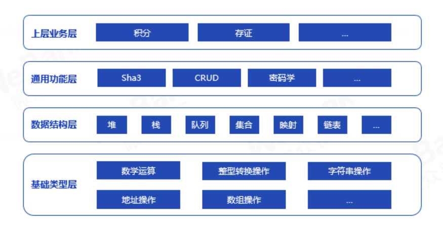

# 组件介绍

## 简介
WeBankBlockchain-SmartDev-Contract智能合约库包含了基础类型、数据结构、通用功能、上层业务等智能合约库。用户可根据实际需求进行参考、复用。

## 代码结构

智能合约库涵盖了从基础类型到上层业务的常见代码，用户可根据实际需要进行参考、复用。智能合约库的结构如下：

## 更多合约库功能
如项目对您有帮助，欢迎点亮我们右上角的[小星星](https://github.com/WeBankBlockchain/SmartDev-Contract)。

更多合约库的功能，欢迎[提交代码](https://github.com/WeBankBlockchain/SmartDev-Contract/pulls)。
