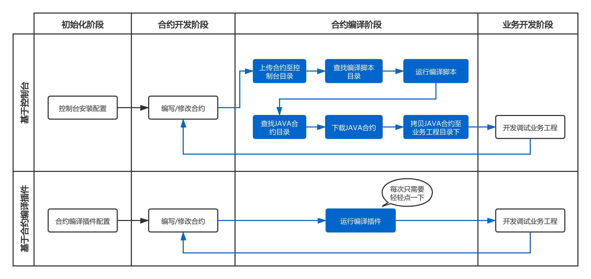

# 组件介绍

## 背景
在开发Java智能合约应用时，需要首先将solidity智能合约代码转换为Java合约代码。通常，开发者需要通过sol2java.sh等控制台工具，[将solidity合约生成出调用该合约java工具类](https://fisco-bcos-documentation.readthedocs.io/zh_CN/latest/docs/sdk/java_sdk/quick_start.html#id4)。

上述步骤的体验与用户开发Java智能合约的应用体验割裂。为此，我们提供了WeBankBlockchain-SmartDev-SCGP智能合约编译插件，通过这种gradle插件的方式，在编译阶段即可实现solidity编译Java工具类的功能，省去了手动安装控制台、拷贝文件、了解shell脚本的步骤，大大简化了应用开发流程。

## 简介
WeBankBlockchain-SmartDev-SCGP智能合约编译插件将solidity智能合约代码编译为Java代码的gradle插件，可以编译项目中的智能合约，生成对应的Java文件，并自动拷贝到对应包目录下。 

## 使用方式对比
在原先基于控制台的编译方式下，用户不仅需要安装控制台这一组件，编译流程也相对繁复，需要拷贝solidity文件到控制台，编译合约后，还需要将java合约拷贝到本地。但如果采用合约编译插件，在完成轻量级的一次性配置后，用户只需在项目工程下运行该插件，插件即会自动从合约目录读取solidity文件并编译为java合约，并会自动拷贝到业务工程下的对应包中。整个过程既不需要安装控制台，也省去了拷贝动作。流程对比如下：

