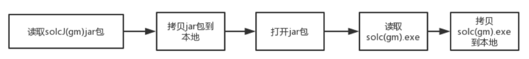
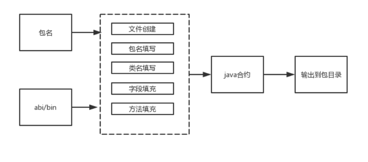

# 组件介绍

## 背景
在开发Java智能合约应用时，需要首先将solidity智能合约代码转换为Java合约代码。通常，开发者需要通过sol2java.sh等控制台工具，[将solidity合约生成出调用该合约java工具类](https://fisco-bcos-documentation.readthedocs.io/zh_CN/latest/docs/sdk/java_sdk/quick_start.html#id4)。

上述步骤的体验与用户开发Java智能合约的应用体验割裂。为此，我们提供了WeBankBlockchain-SmartDev-SCGP智能合约编译插件，通过这种gradle插件的方式，在编译阶段即可实现solidity编译Java工具类的功能，省去了手动安装控制台、拷贝文件、了解shell脚本的步骤，大大简化了应用开发流程。

## 简介
WeBankBlockchain-SmartDev-SCGP智能合约编译插件将solidity智能合约代码编译为Java代码的gradle插件，可以编译项目中的智能合约，生成对应的Java文件，并自动拷贝到对应包目录下。 

## 使用方式对比
在原先基于控制台的编译方式下，用户不仅需要安装控制台这一组件，编译流程也相对繁复，需要拷贝solidity文件到控制台，编译合约后，还需要将java合约拷贝到本地。但如果采用合约编译插件，在完成轻量级的一次性配置后，用户只需在项目工程下运行该插件，插件即会自动从合约目录读取solidity文件并编译为java合约，并会自动拷贝到业务工程下的对应包中。整个过程既不需要安装控制台，也省去了拷贝动作。流程对比如下：

## 实现原理解析

### Solc程序提取
在SolcJ jar包中存放了Solc的可执行文件包，需要从中提取中对应平台的二进制程序包。

下文以windows系统为例，Solc.exe用于将智能合约编译为abi和bin。Solc.exe目前被存放在SolcJ jar包中。而且对于国密，还有一个国密的solcJ-gm jar包。这些jar包被内嵌在插件中。现在需要把两个solc.exe都拷贝出来。

具体的提前过程如下：
1. 通过java的类加载器读取solcJ jar包二进制输入流。
2. 将该solcJ jar包拷贝到本地文件系统中。
3. 通过java自带的jar api打开本地solcJ jar包
4. 将solc.exe拷贝到本地文件系统中。
5. 对于国密版jar包，也重复上述流程。

###	Solc编译
Solc程序执行需要指定智能合约的输入目录，还有编译产物的输出目录。这两样信息需要从插件的配置里取得。
1. 读取项目工程中build.gradle中指定的智能合约输入目录，如果该项未配置，则取默认值src/main/contracts
2. 读取项目工程中的输出目录，如果未配置，则取默认值src/main
3. 将上述信息拼接成solc命令行启动命令
4. 通过java自带命令，启动solc进程
5. 各个合约的编译输出物将被拷贝到输出路径，例如abi会被存放在src/main/abi目录下，bin会被存放在src/main/bin目录下。

###	Java拼接
Java合约用于部署、调用智能合约。为部署合约，一个java合约包含合约的二进制数据（bin）；为调用合约，java合约需要包含各种方法，这些方法对应abi中记录的合约方法和参数。现在需要根据abi和bin来生成java合约。

1. 读取项目工程中build.gradle中指定的java包名，如果该项未配置，则报错
2. 读取先前的abi和bin数据到内存
3. 创建一个空的java文件，文件名取自abi，例如HelloWorld.abi，就生成HelloWorld.java
4. 类生成。其包名为先前配置中的包名。然后拼接public class HelloWorld， 
5. 字段生成。生成字段BINARY和SMBINARY，分别对应合约的bin、国密bin文件。
6. 方法生成。读取abi，根据每一个合约方法的名字和参数，在java中生成对应的method。

