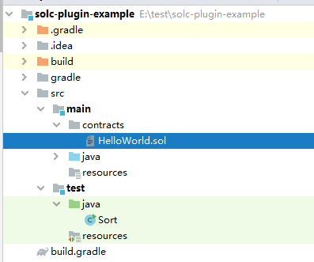
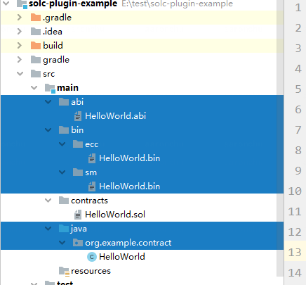

# 快速开始

## 前置依赖

| 依赖软件 | 说明 |备注|
| --- | --- | --- |
| Java |>= JDK[1.8] | |
| Solidity | 0.4.25 | |
| Git | 下载安装包需要使用Git | |
| Gradle | >=6.0.1| |


## 创建业务工程

创建一个空的业务工程，里面的src/main/contracts里包含了智能合约：



## 插件配置

业务方需要在build.gradle中按如下方式引入插件。这段代码直接放在build.gradle首部：

```
buildscript {
    repositories {
        mavenCentral()
        maven { url "http://maven.aliyun.com/nexus/content/groups/public/"}
        maven { url "https://oss.sonatype.org/content/repositories/snapshots" }
        mavenLocal()
    }
    dependencies {
        classpath 'com.webank:solc-gradle-plugin:1.0.0-SNAPSHOT'
        //默认编译0.4.25版本，如果想编译0.6.10.0版本，请添加下述依赖
        //classpath 'org.fisco-bcos:solcJ:0.6.10.0'
        //默认编译0.4.25版本，如果想编译0.5.2.0版本，请添加下述依赖
        //classpath 'org.fisco-bcos:solcJ:0.5.2.0'
    }
}

apply plugin: 'solc-gradle-plugin'

```

然后如下进行配置。如果要生成java合约，还需要通过pkg选项配置java合约所属包名

```
solc{
    pkg = 'org.example.contracts'
}
```

插件的完整配置如下：

| 配置项 | 必选 | 说明 |
| --- | --- | --- |
| pkg | 如果指定onlyAbiBin为false，则必须设置。否则无需设置 | java合约包名|
| contracts | 否 | 智能合约文件路径，默认为src/main/contracts |
| output | 否 | 编译输出路径，默认为src/main |
| onlyAbiBin | 否 | 是否只输出abi和bin默认false|
| selector|否|默认为*，选择所有合约；若选择指定合约，可填所需合约文件名称，按逗号分隔，例如A.sol,B.sol|


## 编译合约

进入java工程：
```
cd solc-plugin-example
```
执行编译:

```
gradle solc
```

编译过后，会发现abi、bin、smbin、java合约已经被拷贝到项目中src/main中：



- abi：编译生成的abi
- bin：二进制文件,包含国密
- java：java合约


