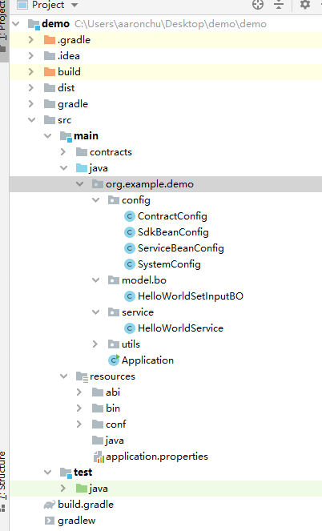

# 组件介绍

智能合约脚手架用于一键式生成DAPP应用开发工程，从而降低应用开发的难度。用户将自己的合约导入脚手架，即可生成对应的应用开发模板工程，包含了对应的POJO类、服务类等，用户可基于此直接开发dapp web项目。

## 前置依赖

在使用本组件前，请确认已安装相关依赖软件，清单如下：

| 依赖软件 | 说明 |备注|
| --- | --- | --- |
| FISCO-BCOS | >= 2.7.1 | |
| Java | JDK[1.8] | |
| Solidity | 0.4.25 | |
| Git | 下载安装包需要使用Git | |


## 快速开始
目前支持基于命令行的方式，后续会推出基于可视化的使用方式，进一步降低用户使用的难度。


### 下载脚手架
从gitub下载脚手架：

```
https://github.com/WeBankBlockchain/SmartDev-Contract.git
```
或者从gitee下载：

```
https://gitee.com/WeBankBlockchain/SmartDev-Contract.git
```

进入目录：
```
cd SmartDev-Scaffold/tools
```

tools目录包含了执行环境，其结构为：
```
├── tools
│   ├── contracts
│   ├──── HelloWorld.sol
│   ├── config.ini
│   ├── run.sh
```
其中：
- contracts目录用于存放solidity合约文件，脚手架后续会读取该目录下的合约以生成对应的业务工程。请删除该目录下的默认合约，并将自己的业务合约拷贝到该目录下。
- config.ini是启动相关配置。
- run.sh是启动脚本

### 配置脚手架
用户可以在config.ini中做轻量化配置，如下：
```
### 项目名称
artifact=demo
### 组名称
group=org.example
### 所支持的合约列表，避免为所有合约生成相应类。默认空，表示为所有合约生成相应代码；如填写此配置项，请按逗号分隔，例如Contract1,Contract2
selector=
```
### 运行脚手架
可以直接启动脚本：
```
chmod +x run.sh
bash run.sh
```

运行成功后，会在tools目录下得到一个基于SpringBoot的项目工程：
```
├─contracts
├─run.sh
└─demo
```
其中生成项目的具体内容如下：



其中：
- config目录包含Bean配置类
- service目录中包含了智能合约访问的Service类，一个类对应一个合约。
- bo目录包含了合约函数输入参数的封装POJO类。
- src/main/resource/conf目录用于存放证书信息

### DAPP开发
这里介绍DAPP开发过程，以前面生成的demo项目工程为例。
#### 部署合约
使用控制台部署HelloWorld合约
#### 证书拷贝
请将配置文件拷贝到生成工程的conf目录或src/main/resources/conf目录下。该业务工程会自动在这些路径下搜索证书。
#### 配置连接节点
请修改application.properties，该文件包含如下信息：
```
### Required
system.peers=127.0.0.1:20200,127.0.0.1:20201
### Required
system.groupId=1
### Optional. Default will search conf,config,src/main/conf/src/main/config
system.certPath=conf,config,src/main/conf,src/main/config
### Optional. If don't specify a random private key will be used
system.hexPrivateKey=
### Optional. Please fill this address if you want to use related service
system.contract.helloWorldAddress=

```
其中system.peers更换成实际的链节点监听地址；system.helloWorldAddress更换成前面部署过的合约地址。

#### 补全业务
一个完整的DAPP应包含至少三层架构，本示例补全一个Controller。
在org.example.controller下新建一个Controller类，如下：
```
@RestController
@RequestMapping("hello")
public class HelloController {

    @Autowired
    private HelloWorldService service;
    
    @GetMapping("set")
    public String set(@RequestParam("n") String n) throws Exception{
        HelloWorldSetInputBO input = new HelloWorldSetInputBO(n);
        return service.set(input).getTransactionReceipt().getTransactionHash();
    }

    @GetMapping("get")
    public String get() throws Exception{
        return service.get().getValues();
    }
}

```

#### 运行jar包
```
cd demo
gradle bootJar
cd dist
```
会在dist目录生成demo-exec.jar，可执行此jar包：
```
java -jar demo-exec.jar
```
随后，可在浏览器内输入:
```
http://127.0.0.1:8080/hello/set?n=hello
```
返回示例：
```
0x1c8b283daef12b38632e8a6b8fe4d798e053feb5128d9eaf2be77c324645763b
```

```
http://127.0.0.1:8080/hello/get
```
返回示例：
```
["hello"]
```
#### 其他
当用户基于生成的项目进行开发时，若需要修改合约，可在项目工程目录下直接编译合约：
```
cd [demo directory]
gradle solc
```

新的abi、bin会被刷新到src/main/resources目录下，但相关Service类和BO类并不会被重新生成，需要用户自行修改。
