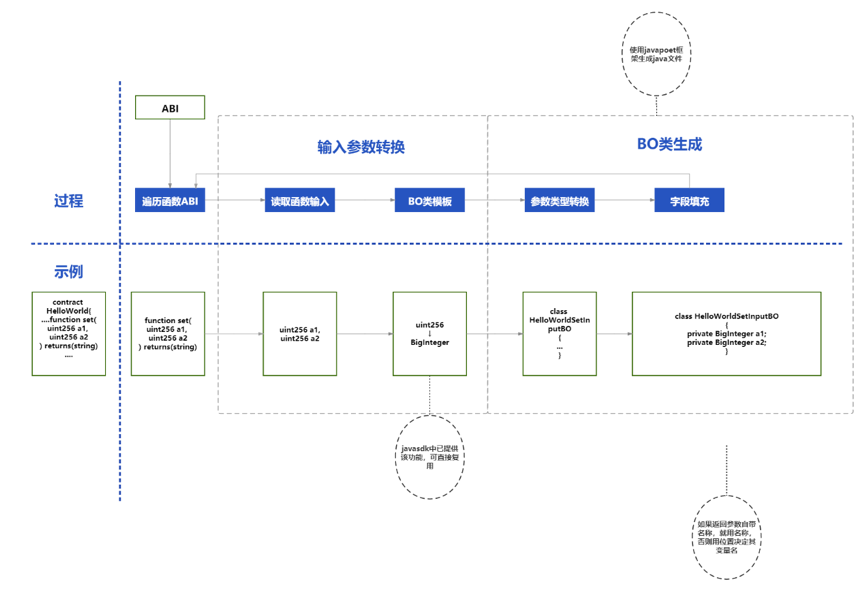
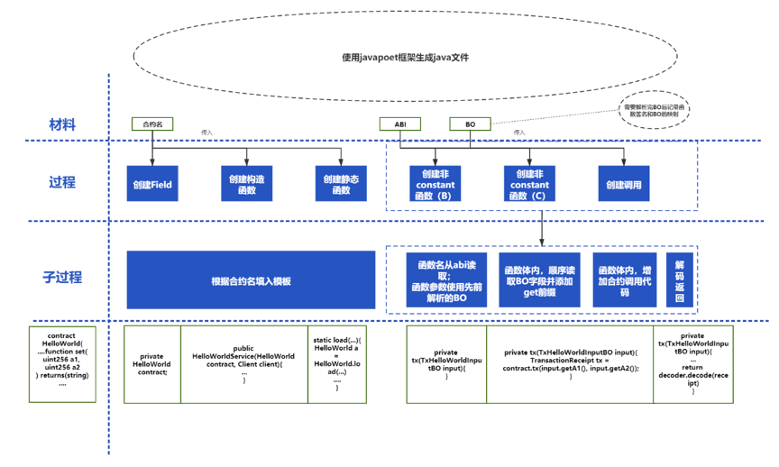

# 组件介绍

## 背景
完整的区块链应用开发，除了智能合约开发外，后台开发也不可或缺。

后台开发又包括项目建立、引入依赖、配置代码编写、模型类编写、服务类编写、业务逻辑编写等步骤，具体的步骤可参考[开发智能合约应用](https://fisco-bcos-documentation.readthedocs.io/zh_CN/latest/docs/sdk/java_sdk/quick_start.html#id3)。这些步骤相对繁琐，影响了开发的效率。例如，我们要为每个合约函数去编写交易构造与推送的代码；甚至，要为每个合约函数的入参编写相应模型类。

分析上述过程，以上步骤存在一定的规律性，可通过脚手架的方式降低重复的工作量，帮助开发者快速、敏捷地开发智能合约应用。因此，我们提供了智能合约脚手架，用于一键式生成DAPP应用开发工程，从而降低应用开发的难度。用户将自己的合约导入脚手架，即可生成对应的应用开发模板工程，包含了对应的POJO类、服务类等，用户可基于此直接开发dapp web项目。

## 简介
智能合约脚手架用于一键式生成DAPP应用开发工程，从而降低应用开发的难度。用户将自己的合约导入脚手架，即可生成对应的应用开发工程，里面已经包含了DAO(Data Access Object)代码，用户可基于此直接开发dapp项目。

## 生成原理

### 合约函数参数BO类的生成
智能合约的ABI记录了每个函数的输入参数，而脚手架希望为每个函数的参数生成一个Java POJO类，这个POJO类的字段对应该函数的参数列表。



生成的步骤如下：
1. 读取合约ABI文件，遍历里面的每一个函数，包含函数名、函数参数等信息。
2. 针对当前遍历到的函数，如果该函数不需要参数，则无需生成java类；如果需要参数，则取ABI中的参数信息并进行下一步 
3. 通过javapoet框架创建一个空类，类名遵照[合约名]+[函数名]+InputBO的规则，例如HelloWorldSetInputBO。
4. 遍历参数列表，每个参数转换为java类的字段，其中字段名采用参数名；字段类型由参数类型按固定规则转换而来，该规则用于将每个参数的类型信息（基于solidity语言）转换为java类型，例如uint256转换为BigInteger。


### 合约Service类的生成
Solidity每一个合约，均希望产生一个Java Service类，用户像使用DAO类一样使用这个类，完成与区块链的交互。这个Service类的例子：

```java
public class HelloWorldService {
  public static final String ABI = org.example.demo.contracts.HelloWorld.ABI;

  public static final String BINARY = org.example.demo.contracts.HelloWorld.BINARY;

  public static final String SM_BINARY = org.example.demo.contracts.HelloWorld.BINARY;

  private String address;

  private Client client;

  AssembleTransactionProcessor txProcessor;

  public HelloWorldService(String address, Client client) throws Exception {
    this.client = client;
    this.txProcessor = TransactionProcessorFactory.createAssembleTransactionProcessor(this.client, this.client.getCryptoSuite().getCryptoKeyPair());
    this.address = address;
  }

  public HelloWorldService(Client client) throws Exception {
    this.client = client;
    this.txProcessor = TransactionProcessorFactory.createAssembleTransactionProcessor(this.client, this.client.getCryptoSuite().getCryptoKeyPair());
    this.address = this.txProcessor.deployAndGetResponse(ABI,this.client.getCryptoType()==0?BINARY:SM_BINARY).getContractAddress();
  }

  public TransactionResponse set(HelloWorldSetInputBO input) throws Exception {
    return this.txProcessor.sendTransactionAndGetResponse(this.address, ABI, "set", input.toArgs());
  }

  public CallResponse get() throws Exception {
    return this.txProcessor.sendCall(this.client.getCryptoSuite().getCryptoKeyPair().getAddress(), this.address, ABI, "get", Arrays.asList());
  }
}

```



实现的步骤如下：
1. 使用javapoet框架生成空Service类，它的名称为[合约名]+Service，例如HelloWorldService
2.	创建Service类的字段。通过向javapoet类中填入这些字段的类型、名称的信息。
3.	创建构造方法。通过向javapoet类中填入构造函数中所需语句即可。
4.	创建静态方法。通过向javapoet类中填入构造函数中所需语句即可。
5.	创建合约调用方法。先遍历合约ABI的每个函数，向javapoet写入方法定义，其中：
    a)	方法名与合约函数同名
    b)	方法参数类型采用第一节中生成的BO类名
    c)	如果该函数的不包含view、pure、constant修饰符，则方法体填入`this.txProcessor.sendTransactionAndGetResponse`。
	否则，方法体填入：`this.txProcessor.sendCall`。

