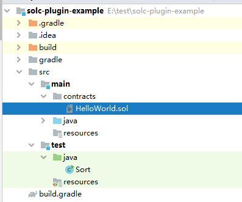
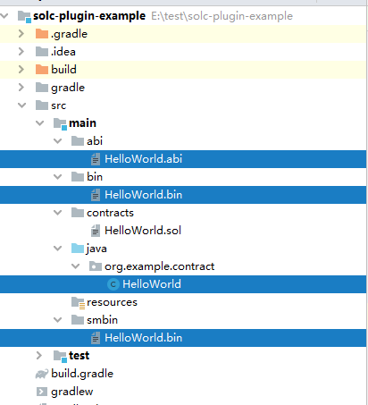

# 组件介绍

在原先基于控制台的编译方式下，用户不仅需要安装控制台这一组件，编译流程也相对繁复，需要拷贝solidity文件到控制台，编译合约后，还需要将java合约拷贝到本地。但如果采用合约编译插件，在完成轻量级的一次性配置后，用户只需在项目工程下运行该插件，插件即会自动从合约目录读取solidity文件并编译为java合约，并会自动拷贝到业务工程下的对应包中。整个过程既不需要安装控制台，也省去了拷贝动作。流程对比如下：


## 1. 前置依赖

| 依赖软件 | 说明 |备注|
| --- | --- | --- |
| Java | JDK[1.8] | |
| Git | 下载代码需要使用Git | |

## 2. 快速开始

### 2.1. 下载与安装

下载代码：

```
git clone git@github.com:WeBankBlockchain/Toolkit-SCGP.git
```

安装插件：

```
cd Toolkit-SCGP
gradle install
```


### 2.2. 创建业务工程

下述业务工程是典型的java dapp项目工程，里面的src/main/contracts里包含了智能合约：



### 2.3. 插件配置

业务方只需要在build.gradle中引入插件：

```
buildscript {
    repositories {
        mavenCentral()
        maven { url "http://maven.aliyun.com/nexus/content/groups/public/"}
        maven { url "https://oss.sonatype.org/content/repositories/snapshots" }
        maven { url "https://dl.bintray.com/ethereum/maven/" }
        mavenLocal()
    }
    dependencies {
        classpath 'com.webank:solc-gradle-plugin:1.0-SNAPSHOT'
    }
}

apply plugin: 'solc-gradle-plugin'

```

然后进行配置，只需要配置包名即可：

```
solc{
    pkg = 'org.example.contracts'
}

```

### 2.3. 编译合约

进入java工程：
```
cd solc-plugin-example
```
执行编译:

```
gradle solc
```

编译过后，会发现abi、bin、smbin、java合约已经被拷贝到项目中src/main中：



- abi：编译生成的abi
- bin：二进制文件
- smbin：国米版二进制文件
- java：java合约

## 3. 详细配置

插件的完整配置如下：

| 配置项 | 必选 | 说明 |
| --- | --- | --- |
| pkg | 是 | java合约包名 |
| contracts | 否 | 智能合约文件相对路径，默认为src/main/contracts |
| output | 否 | 编译输出的相对路径，默认为src/main |

## 4. 其他说明

编译出来的java合约是基于java sdk的，原版web3sdk无法使用。