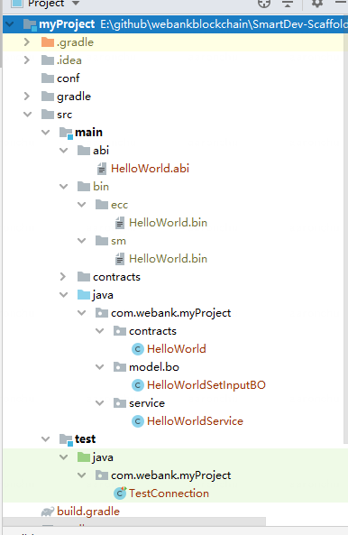

# 组件介绍

## 简介
智能合约脚手架用于一键式生成DAPP应用开发工程，从而降低应用开发的难度。用户将自己的合约导入脚手架，即可生成对应的应用开发模板工程，包含了java合约、测试代码等。此外，当用户修改了合约时，不必再使用控制台重新编译，而是可通过植入项目的gradle插件进行编译，新编译的java合约会被更新到项目中。

## 前置依赖

在使用本组件前，请确认已安装相关依赖软件，清单如下：

| 依赖软件 | 说明 |备注|
| --- | --- | --- |
| FISCO-BCOS | >= 2.7.1 | |
| Java | JDK[1.8] | |
| Solidity | 0.4.25 | |
| Git | 下载安装包需要使用Git | |


## 快速开始
目前支持基于命令行的方式，后续会推出基于可视化的使用方式，进一步降低用户使用的难度。


### 源码下载
```
git clone https://github.com/WeBankBlockchain/SmartDev-Scaffold.git
cd SmartDev-Scaffold
```

### 拷贝合约代码和配置文件

将solidity文件拷贝到SmartDev-Scaffold的contracts目录下
```
cp -r [solidity folder]/* contracts
```

将配置文件拷贝到SmartDev-Scaffold的conf目录下。conf包含证书和配置信息，更多请见
```
cp -r [conf]/* conf
```
### 运行脚手架

```
chmod +x run.sh
bash run.sh
```

用户可以指定group名和项目名，例如
```
bash run.sh com.webank demo
```

如果用户不指定，则默认group采用org.example, 项目名采用demo。输出物的包名将结合gorup和项目名。

### 生成效果
运行成功后，可在artifacts目录下得到项目工程，如下示例：



可直接运行新的工程的测试用例，该测试用例会测试和节点的连接性，如未报错即为成功：
```
cd [demo directory]
gradle test
```

### 后续合约开发

当用户基于生成的项目进行开发时，若需要修改合约，用户在修改完合约后，可在项目工程目录下直接编译合约：
```
cd [demo directory]
gradle solc
```

新的java合约及abi、bin会被刷新到目录下。

### 后续项目开发

用户可调用生成的Service类，例如：

```
    @Test
    public void demo() throws Exception {

        BcosSDK bcosSDK = BcosSDK.build("conf/config.toml");
        Client client = bcosSDK.getClient(1);

        String contractAddress = "0x...";
        EvidenceControllerService service
                = new EvidenceControllerService(contractAddress, client);
        TransactionResponse response = service.voteSaveRequest(new EvidenceControllerVoteSaveRequestInputBO(new byte[]{1,2,3}));

    }
```