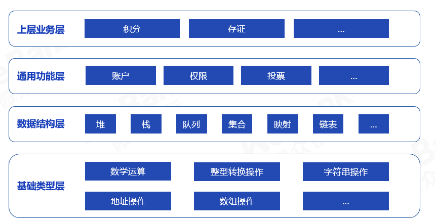

# 智能合约库WeScott

智能合约库涵盖了从基础类型到上层业务的常见代码，用户可根据实际需要进行参考、复用。

## 1. 整体结构
智能合约库的结构如下：

### 1.1. 基础类型层

| 库 | 功能 | 说明 |
| --- | --- | --- |
|LibSafeMathForUint256Utils|数学运算|加减乘除、幂、最大值最小值、平均值等|
|LibConverter|整型转换操作|和各数据类型之间的转换等|
|LibString|字符串操作|取长度、判断起始终止、查找子父、求子串、拼接、比较、大小写转换等|
|LibAddress|地址操作|和各数据类型之间的转换；合约地址判断等|
|LibArrayForUint256Utils|数组操作|排序、查找、去重、拼接等|

### 1.2. 数据结构层

| 库 | 功能 | 说明 |
| --- | --- | --- |
|LibMaxHeapUint256\LibMinHeapUint256|堆|堆相关操作，取最值、插入、删除等。支持最大堆、最小堆|
|LibStack|栈|提供栈相关操作，如进栈、出栈等|
|LibQueue\LibDequeu|队列|队列相关操作，入队、出队等。支持单向队列、双向队列|
|LibBytes32Set\LibAddressSet|集合|集合操作，增删改查等|
|LibBytesMap|映射|映射操作，存、取、移除等|
|LibLinkedList|链表|链表相关操作。支持双向链表|

### 1.3. 通用功能层
| 库 | 功能 | 说明 |
| --- | --- | --- |
|AccountManager|账户治理|提供外部账户和内部账户的映射，可用于私钥找回等场景|
|AuthManager|权限治理|提供基于组的权限管控方案|
|LibVote|投票|提供投票逻辑，包括多签投票、阈值投票等|

### 1.4. 上层业务层

| 库 | 功能 | 说明 |
| --- | --- | --- |
|Evidence|存证|存证场景相关操作，上传、审批、修改、删除等|
|RewardPoint|积分|积分场景相关操作，发行、转移等|

## 2. 使用方法

