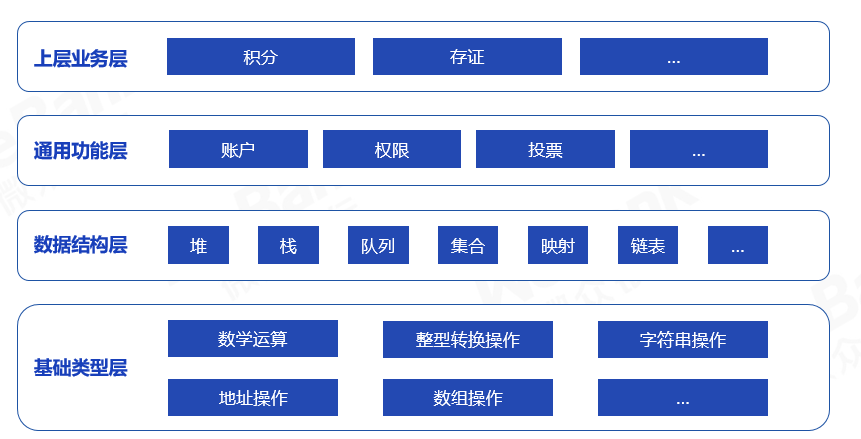

# 组件介绍

## 1. 整体结构

智能合约库涵盖了从基础类型到上层业务的常见代码，用户可根据实际需要进行参考、复用。智能合约库的结构如下：



### 1.1. 基础类型层

| 库 | 功能 | 说明 | API |
| --- | --- | --- | --- |
|LibSafeMathForUint256Utils|数学运算|加减乘除、幂、最大值最小值、平均值等| [API](./api/types/LibSafeMathForUint256Utils.html) |
|LibConverter|整型转换操作|和各数据类型之间的转换等| [API](./api/types/LibConverter.html)|
|LibString|字符串操作|取长度、判断起始终止、查找子父、求子串、拼接、比较、大小写转换等|[API](./api/types/LibString.html) |
|LibAddress|地址操作|和各数据类型之间的转换；合约地址判断等|[API](./api/types/LibAddress.html)|
|LibArrayForUint256Utils|数组操作|排序、查找、去重、拼接等|[API](./api/types/LibArrayForUint256Utils.html) |

### 1.2. 数据结构层

| 库 | 功能 | 说明 | API |
| --- | --- | --- | --- |
|LibMaxHeapUint256|堆|最大堆相关操作，取最值、插入、删除等| [API](./api/data_structures/LibMaxHeapUint256.html)|
|LibMinHeapUint256|堆|最小堆相关操作，取最值、插入、删除等| [API](./api/data_structures/LibMinHeapUint256.html)|
|LibStack|栈|提供栈相关操作，如进栈、出栈等|[API](./api/data_structures/LibStack.html) |
|LibQueue|队列|单向队列相关操作，入队、出队等|[API](./api/data_structures/LibQueue.html)|
|LibDeque|队列|双向队列相关操作，入队、出队等|[API](./api/data_structures/LibDeque.html)|
|LibBytes32Set|bytes32类型集合|集合操作，增删改查等| [API](./api/data_structures/LibBytes32Set.html)|
|LibAddressSet|address类型集合|集合操作，增删改查等| [API](./api/data_structures/LibAddressSet.html)|
|LibBytesMap|映射|映射操作，存、取、移除等|[API](./api/data_structures/LibBytesMap.html)|
|LibLinkedList|双向链表|链表相关操作|[API](./api/data_structures/LibLinkedList.html)|

### 1.3. 通用功能层
| 库 | 功能 | 说明 | API |
| --- | --- | --- | --- |
|AccountManager|账户治理|提供外部账户和内部账户的映射，可用于私钥找回等场景| |
|AuthManager|权限治理|提供基于组的权限管控方案||
|LibVote|投票|提供投票逻辑，包括多签投票、阈值投票等||

### 1.4. 上层业务层

| 库 | 功能 | 说明 | API |
| --- | --- | --- | --- |
|Evidence|存证|存证场景相关操作，上传、审批、修改、删除等|[API](./api/biz_templates/Evidence.html)|
|RewardPoint|积分|积分场景相关操作，发行、转移等|[API](./api/biz_templates/RewardPoint.html)|


## 2. 如何使用

通过git下载源码：

```
git clone XXX
```

